<div align="center">


<h1>Cloud Economics Calculator</h1>

<p><strong>The Enterprise Flagship Platform for Financial Modeling, TCO Analysis, and Multi-Cloud Investment Strategy</strong></p>

[]()
[]()
[]()
[]()

<br/>

> **"Cloud is not just a technology shift; it's a fundamental business model transformation."** 
> Cloud Economics Calculator is a sophisticated financial modeling platform designed to provide CIOs, CFOs, and Architects with the data-driven clarity needed to justify cloud investments, optimize migrations, and maximize the business value of every cloud dollar.

</div>

---

## 🏛️ Executive Summary

The **Cloud Economics Calculator** is a premium decision-support system designed for institutional cloud leaders. In the current economic climate, "cloud-at-any-cost" has been replaced by "cloud-for-value." Organizations must be able to quantify the Total Cost of Ownership (TCO) and Return on Investment (ROI) of their cloud estates with precision.

This platform provides a unified suite of calculators and scenario modeling tools to compare on-prem vs. cloud, benchmark Azure vs. AWS vs. GCP, and project the long-term impact of commitment-based discounts and architectural modernization.

---

## 💡 Why Cloud Economics Matters

Cloud economics is the study of the financial principles of the cloud, focusing on the value, cost, and risk of cloud consumption. It differs from traditional IT finance due to:
- **Variable vs. Fixed Costs**: Shifting from CapEx (upfront hardware) to OpEx (pay-as-you-go consumption).
- **Infinite Scalability**: The financial risk of unchecked resource growth.
- **Architectural Impact**: How serverless, containers, and right-sizing directly influence the bottom line.
- **Unit Economics**: Understanding the cost to serve a single customer or transaction.

---

## 🚀 Business Outcomes

### 🎯 Strategic Impact
- **Data-Backed Business Cases**: Secure board-level approval for large-scale migration and modernization programs.
- **Optimized Capital Allocation**: Identify exactly where cloud spend generates the highest business value.
- **Reduced Financial Risk**: Forecast spend spikes and budget breaches before they occur.
- **Institutional FinOps Maturity**: Embed financial accountability into the engineering culture.

---

## 📊 Methodology: TCO & ROI

### 1. Total Cost of Ownership (TCO)
Our model decomposes TCO into five primary pillars:
- **Compute & Storage**: Direct cloud consumption costs.
- **Network & Data Egress**: The "hidden" costs of data movement.
- **Labor & Operations**: The cost of human capital required to manage the environment.
- **Software & Licensing**: OS, Database, and Security license mobility.
- **Facilities & Real Estate**: The decommissioning value of on-prem data centers.

### 2. Return on Investment (ROI)
ROI is measured through three lenses:
- **Direct Cost Savings**: Lowering the TCO compared to on-prem or inefficient cloud patterns.
- **Business Agility**: The value of faster time-to-market (TTM) for new features.
- **Operational Resilience**: Reducing the cost of downtime and security incidents.

---

## 🛠️ Technical Stack

| Layer | Technology | Rationale |
|---|---|---|
| **Cloud** | Azure / AWS / GCP | Multi-cloud ready architecture. |
| **Frontend** | React 18, Vite, Tailwind CSS | High-performance, reactive financial dashboards. |
| **Backend** | FastAPI (Python) | High-concurrency API for complex mathematical modeling. |
| **Pricing Engine** | Python, Pandas, NumPy | vectorized calculations for multi-region pricing catalogs. |
| **Database** | PostgreSQL | Relational storage for scenario metadata and benchmarks. |
| **Infra (IaC)** | Terraform | Standardized multi-cloud resource orchestration. |
| **Deployment** | AKS / EKS / GKE | Scalable, resilient microservice hosting. |

---

## 📐 Architecture Storytelling: 40+ Diagrams

### 1. High-Level Executive Architecture
The bird's-eye view of the platform, from data ingestion to board-level reporting.

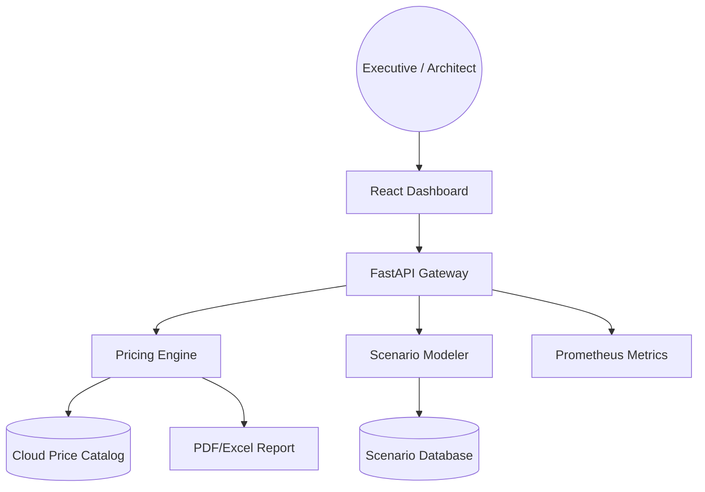

### 2. Detailed Component Topology
The internal service mesh and data persistence layer.

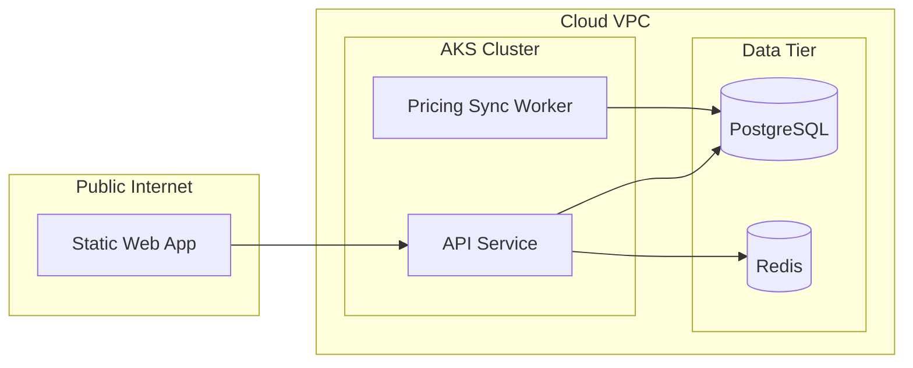

### 3. Frontend to Backend Request Path
Tracing a calculation request from the UI to the pricing engine.

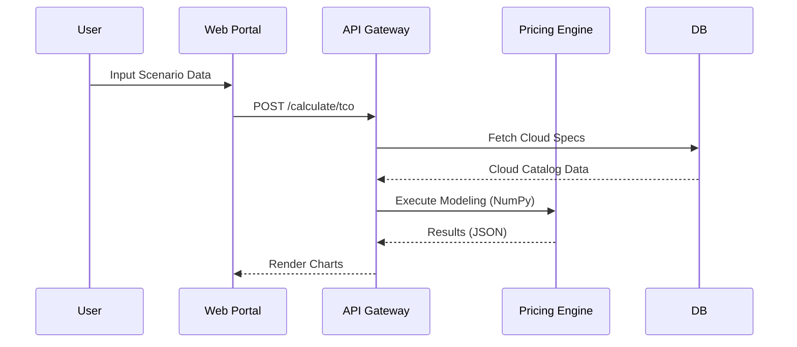

### 4. Pricing Engine Architecture
How the platform manages millions of pricing combinations across regions.

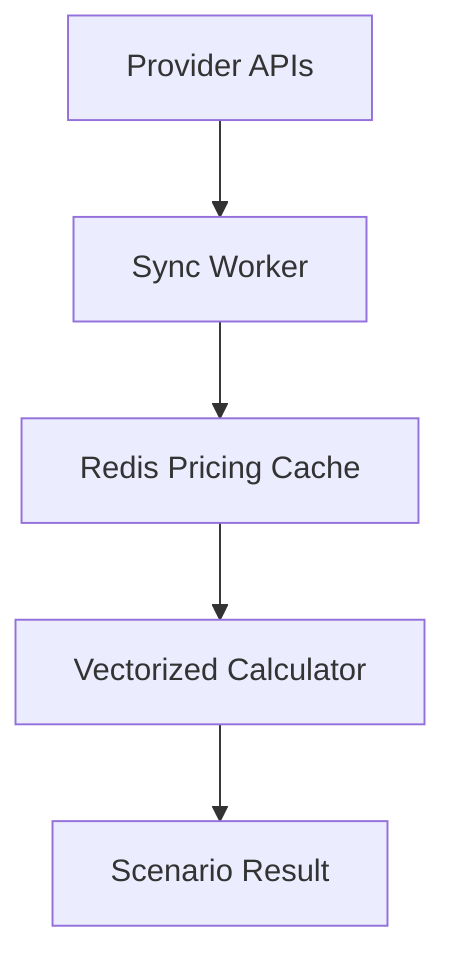

### 5. Multi-Cloud Ingestion Topology
Harmonizing pricing data from Azure, AWS, and GCP.

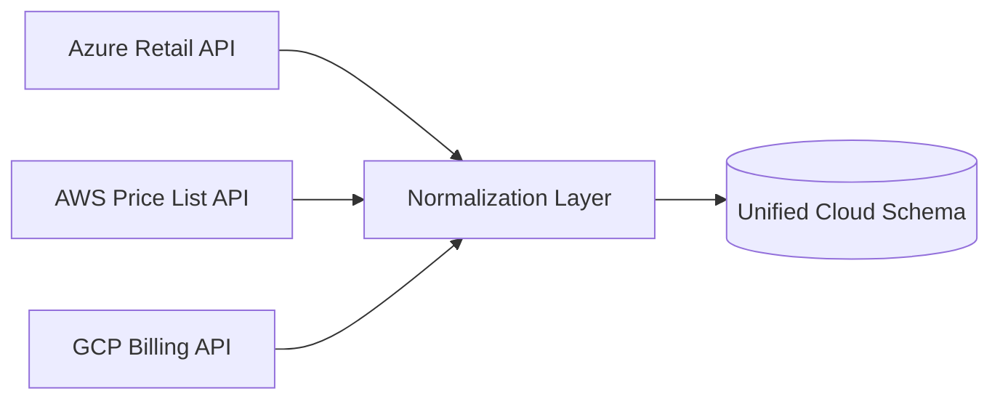

### 6. Regional Deployment Model
Ensuring data residency for sensitive financial models.

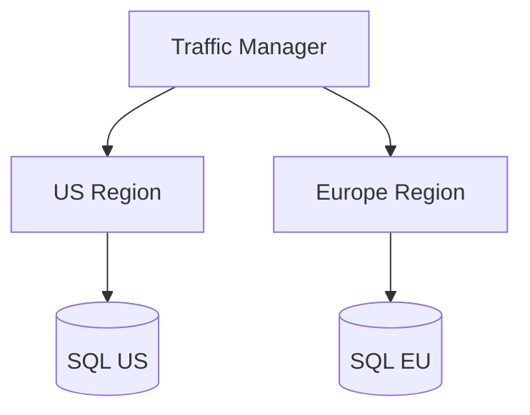

### 7. DR Failover Model
Business continuity for the critical investment decision platform.

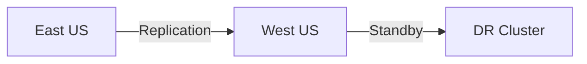

### 8. API Gateway Architecture
Managing security, throttling, and routing for the economics API.

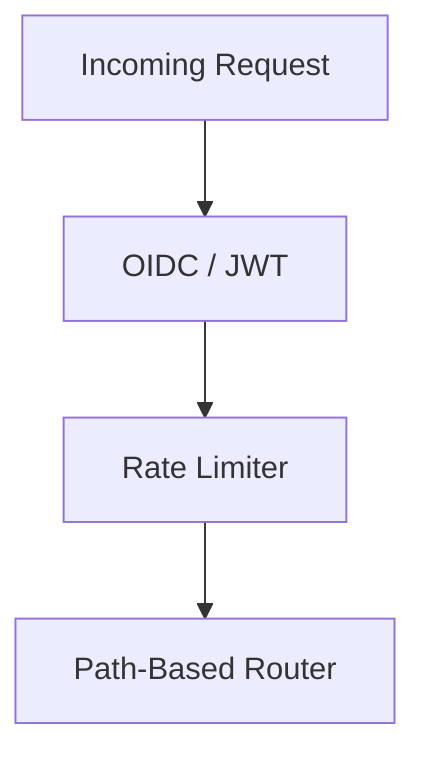

### 9. Queue Worker Architecture
Handling the heavy lifting of large-scale forecast simulations.

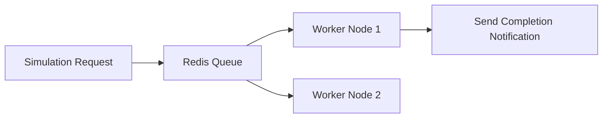

### 10. Dashboard Analytics Flow
How real-time scenarios are visualized for leadership.

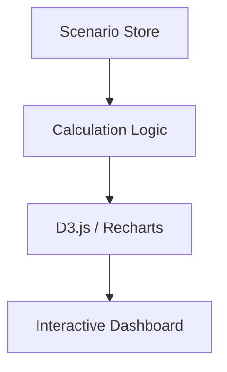

### 11. TCO Calculation Workflow
The systematic decomposition of direct and indirect costs.

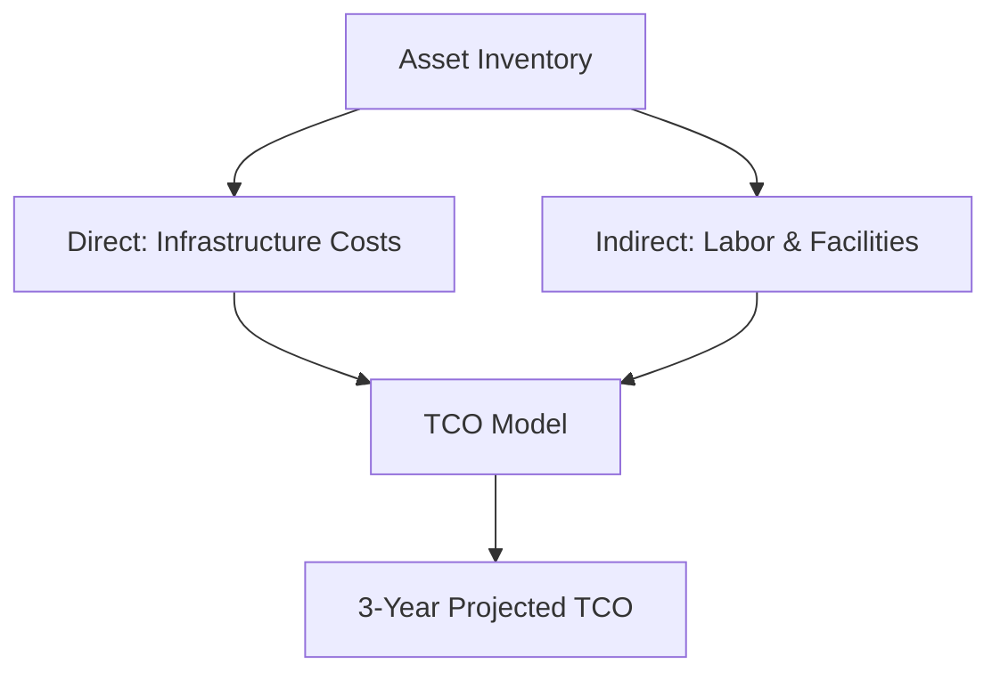

### 12. ROI Formula Workflow
Calculating the financial return of a cloud migration or modernization.

```mermaid
graph LR
    Invest[Investment $] --> Savings[Expected Savings $]
    Savings --> Gain[Business Value $]
    Gain --> Formula[ROI = (Gain - Invest) / Invest]
    Formula --> Score[Investment Score]
```

### 13. Migration Cost Model
Quantifying the "Migration Bubble" (double-run costs).

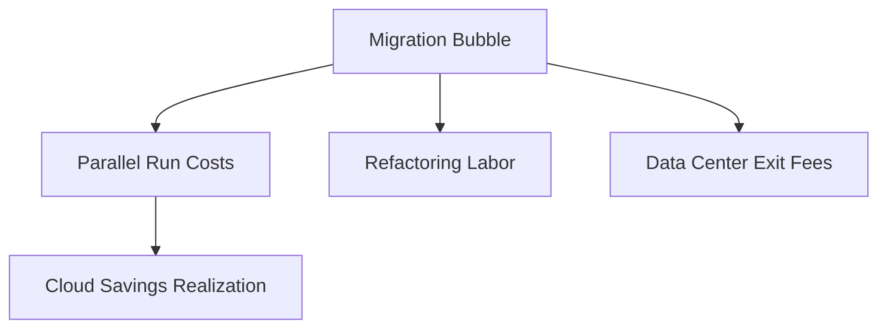

### 14. On-Prem vs. Cloud Comparison Flow
A side-by-side financial breakdown.

```mermaid
graph LR
    OnPrem[Server/Rack/Cooling] vs[VS] Cloud[Instance/Storage/PaaS]
    OnPrem --> CapEx[Upfront CapEx]
    Cloud --> OpEx[Variable OpEx]
```

### 15. Reserved Instance Savings Model
Projecting the impact of 1-year and 3-year commitments.

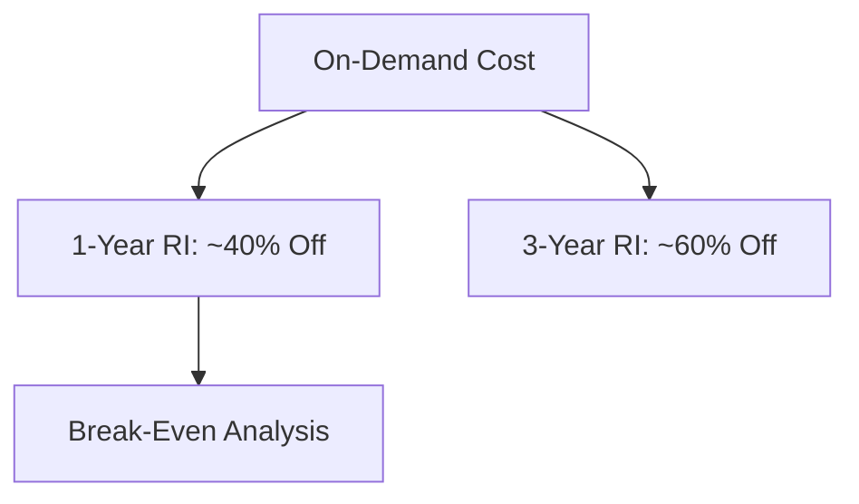

### 16. Savings Plan Optimizer Flow
Finding the optimal commitment level for dynamic workloads.

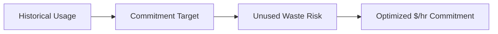

### 17. Kubernetes Cost Allocation Flow
Decomposing shared cluster costs by namespace or label.

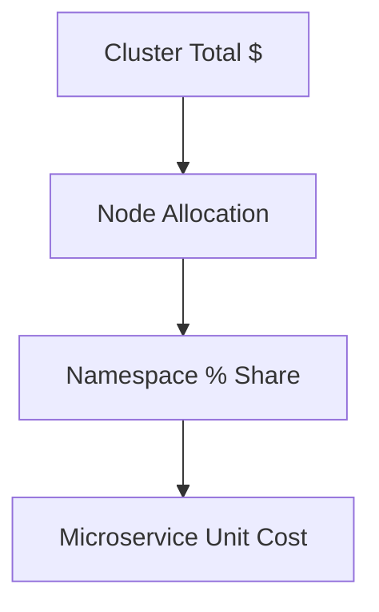

### 18. Storage Lifecycle Economics Flow
Saving costs by moving data to colder tiers.

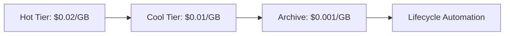

### 19. Network Egress Cost Model
Calculating the cost of data movement across regions and clouds.

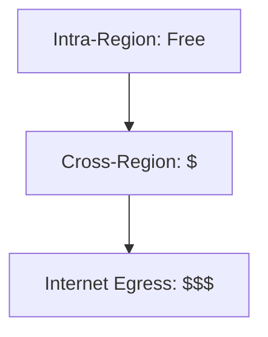

### 20. Sustainability Cost/Carbon Model
Mapping spend and usage to carbon footprint (mtCO2e).

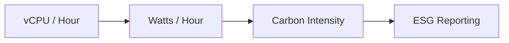

### 21. What-If Scenario Workflow
Testing the impact of architectural changes.

```mermaid
graph TD
    Base[Current State] --> Change[Scenario: Serverless Move]
    Change --> Impact[Projected Cost Delta]
```

### 22. Growth Forecast Model
Predicting future spend based on user/transaction growth.

```mermaid
graph LR
    Users[User Growth %] --> Scaling[Resource Scaling]
    Scaling --> Forecast[Budget Requirement]
```

### 23. Price Change Sensitivity Model
Assessing risk against cloud provider price increases.

```mermaid
graph TD
    Price[Price +5%] --> Budget[Budget Impact]
    Budget --> Mitigation[Optimization Priority]
```

### 24. Budget Planning Workflow
Aligning engineering targets with finance constraints.

```mermaid
graph LR
    Finance[Annual Budget] --> Engineering[Team Targets]
    Engineering --> Tracking[Real-time Burn Rate]
```

### 25. Chargeback / Showback Model
Attributing costs to business units.

```mermaid
graph TD
    Bill[Consolidated Invoice] --> Tag[Tag-based Attribution]
    Tag --> BusinessUnit[Department Invoice]
```

### 26. Executive Business Case Workflow
Structuring the story for the CFO.

```mermaid
graph LR
    Problem[High TCO] --> Solution[Migration]
    Solution --> Financials[ROI / Payback Period]
```

### 27. M&A Cloud Consolidation Model
Estimating savings from merging duplicate cloud tenants.

```mermaid
graph TD
    TenantA[Company A] + TenantB[Company B] --> Unified[Shared Savings Plan]
```

### 28. Multi-Region Expansion Model
Calculating the cost of global high-availability.

```mermaid
graph LR
    Single[Single Region] --> Multi[Multi-Region: 2x Cost]
```

### 29. AI Workload Economics Model
The high cost of GPUs and LLM tokens.

```mermaid
graph TD
    GPU[GPU Compute] --> Token[Inference Token Cost]
    Token --> Training[Model Training Cost]
```

### 30. License Optimization Model
Savings from BYOL (Bring Your Own License) and Hybrid Benefit.

```mermaid
graph LR
    New[New License: Full $] --> BYOL[Existing License: 40% Off]
```

### 31. OIDC / SSO Auth Flow
Secure enterprise identity integration.

```mermaid
sequenceDiagram
    User->>Portal: Login
    Portal->>IdP: Redirect to Entra/Okta
    IdP-->>Portal: Identity Token
```

### 32. RBAC Model
Permissions for Finance, Engineering, and Admins.

```mermaid
graph LR
    Admin[Full Access]
    Finance[Read Reports]
    Architect[Create Scenarios]
```

### 33. Secrets Management Flow
Protecting cloud provider credentials.

```mermaid
graph TD
    Vault[Azure Key Vault] --> API[Secure Access]
```

### 34. Audit Logging Architecture
Ensuring transparency in financial modeling.

```mermaid
graph LR
    User[Action] --> Log[Immutable Audit Trail]
```

### 35. Network Boundary Model
Isolating the calculation engine.

```mermaid
graph TD
    VNet[Private VNet] --> DB[(Encrypted Database)]
```

### 36. Metrics Pipeline
Monitoring calculation latency and throughput.

```mermaid
graph LR
    API[Metrics] --> Prom[Prometheus]
```

### 37. Logging Flow
Centralized log management.

```mermaid
graph TD
    Log[JSON Logs] --> ELK[Log Analytics]
```

### 38. Tracing Model
Tracing distributed pricing calculations.

```mermaid
sequenceDiagram
    API->>Worker: Start Calc
    Worker->>DB: Fetch Price
```

### 39. SLA Monitoring Model
Guaranteeing platform availability for budget cycles.

```mermaid
graph LR
    Probe[Health Check] --> SLA[99.9% Uptime]
```

### 40. Release Pipeline Workflow
Automated deployment of the FinOps platform.

```mermaid
graph LR
    Git[Code Push] --> CI[Build/Test]
    CI --> CD[Deploy to AKS]
```

---

## 📈 FinOps Decision Frameworks

### 1. The "Migration Bubble" Strategy
When migrating to the cloud, costs initially rise as you run parallel environments. Our calculator helps you project the **break-even point** where cloud savings overtake on-prem costs.

### 2. The RI vs. SP Decision Matrix
- **Reserved Instances (RI)**: Best for stable, predictable workloads with specific SKU requirements.
- **Savings Plans (SP)**: Best for dynamic workloads and organizations that frequently modernize their compute tiers.

---

## 🚦 Getting Started

### 1. Prerequisites
- **Docker Desktop** installed.
- **Terraform** (v1.5+).
- **Node.js** (v18+) and **Python** (v3.11+).

### 2. Local Setup
```bash
# Clone the repository
git clone https://github.com/Devopstrio/cloud-economics-calculator.git
cd cloud-economics-calculator

# Setup environment
cp .env.example .env

# Start core services
docker-compose up --build
```
Access the dashboard at `http://localhost:3000`.

---

## 🛡️ Governance & Security
- **Data Privacy**: No sensitive financial data is stored outside of your encrypted PostgreSQL instance.
- **Auditability**: Every scenario created is logged for compliance reviews.
- **Least Privilege**: The pricing sync worker uses read-only credentials to fetch cloud pricing catalogs.

---
<sub>&copy; 2026 Devopstrio &mdash; Engineering the Future of Cloud Economics.</sub>
