<div align="center">


<h1>Cloud Economics Calculator</h1>

<p><strong>The Institutional-Grade Platform for Standardized Economic Foundations, Financial Governance, and Multi-Cloud Investment Ecosystems.</strong></p>

[]()
[]()
[]()

<br/>

> **"Industrializing cloud economics to automate financial foundations."** 
> **Cloud Economics Calculator** is an enterprise-grade platform designed to provide a secure, measurable, and highly automated foundation for global economic operations. It orchestrates the complex lifecycle of cloud financial modeling—from automated TCO analysis and multi-cloud ROI forecasting to high-throughput investment intelligence and unified financial auditing.

</div>

---

## 🏛️ Executive Summary

Fragmented financial modeling and manual TCO analysis are strategic operational liabilities; lack of a standardized cloud economics calculator framework is a primary barrier to organizational engineering maturity. Organizations fail to justify their cloud investments not because of a lack of data, but because of fragmented measurement standards, lack of automated scenario modeling, and an inability to orchestrate financial planes with operational precision.

This platform provides the **Financial Intelligence Plane**. It implements a complete **Cloud-Economics-Calculator-as-Code Framework**, enabling CIOs and CFOs to manage global economic foundations as first-class citizens. By automating the identification of financial regressions through real-time telemetry analysis and orchestrating the provisioning of secure performance-driven financial policies, we ensure that every organizational cloud investment—from core migration programs to edge modernization initiatives—is modeled by default, audited for history, and strictly aligned with institutional financial frameworks.

---

## 📐 Architecture Storytelling: Principal Reference Models

### 1. Principal Architecture: Global Cloud Economics Calculator & Financial Intelligence Plane
This diagram illustrates the end-to-end flow from financial telemetry ingestion and multi-cloud orchestration to investment enforcement, performance validation, and institutional financial auditing.

```mermaid
graph LR
    %% Subgraph Definitions
    subgraph EconomicIngress["Cost & Benefit Ingress"]
        direction TB
        Cloud_Pricing["Azure / AWS / GCP / SaaS Catalogs"]
        OnPrem_Signals["Server / Rack / Cooling / Labor Costs"]
        Business_Targets["ROI Goals / Payback / Budget Limits"]
    end

    subgraph IntelligenceEngine["Financial Intelligence Hub"]
        direction TB
        API["FastAPI Economic Gateway"]
        ModelingOrchestrator["Global TCO & ROI Hub"]
        Governance_Hub["Compliance & Guardrail Hub"]
        AIOps_Validator["Drift & Risk Analysis Hub"]
    end

    subgraph OperationsPlane["Distributed Economic Ecosystem"]
        direction TB
        ManagedModelNodes["Managed Standardized Financial Models"]
        ActiveForecasts["Managed Automated Business Cases"]
        InvestmentSinks["Managed Infrastructure Delivery Hubs"]
    end

    subgraph OperationsHub["Institutional Data Hub"]
        direction TB
        Scorecard["Economic Maturity Scorecard"]
        Analytics["Savings Flow & ROI Velocity Stats"]
        Audit["Forensic Financial Metadata Lake"]
    end

    subgraph DevOps["Cloud-Economics-Calculator-as-Code Framework"]
        direction TB
        TF["Terraform Financial Modules"]
        DriftBot["Productivity & Config Drift Validator"]
        ChatOps["Measurement Operations Hub"]
    end

    %% Flow Arrows
    EconomicIngress -->|1. Submit Telemetry| API
    API -->|2. Orchestrate Finance| ModelingOrchestrator
    ModelingOrchestrator -->|3. Apply Privacy Guard| Governance_Hub
    Governance_Hub -->|4. Assess Drift| AIOps_Validator
    
    AIOps_Validator -->|5. Execute Modeling| OperationsPlane
    OperationsPlane -->|6. Notify Status| ChatOps
    API -->|7. Visualize Health| Scorecard
    
    Scorecard -->|8. Track Maturity| Analytics
    Scorecard -->|9. Record Performance| Audit
    
    TF -->|10. Provision Backbone| IntelligenceEngine
    DriftBot -->|11. Inject Friction Risk| ModelingOrchestrator
    Audit -->|12. Improve Operations| ManagedModelNodes

    %% Styling
    classDef ingress fill:#f5f5f5,stroke:#616161,stroke-width:2px;
    classDef intel fill:#e8eaf6,stroke:#1a237e,stroke-width:2px;
    classDef operations fill:#e1f5fe,stroke:#01579b,stroke-width:2px;
    classDef ops fill:#ede7f6,stroke:#311b92,stroke-width:2px;
    classDef devops fill:#e8f5e9,stroke:#1b5e20,stroke-width:2px;

    class EconomicIngress ingress;
    class IntelligenceEngine intel;
    class OperationsPlane operations;
    class OperationsHub ops;
    class DevOps devops;
```

### 2. The Economic Lifecycle Flow
The continuous path of a cloud economics platform from initial integration (model) and aggregation (analyze) to active analysis (forecast), optimization (justify), and institutional forensic auditing (scorecard).

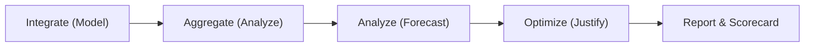

### 3. Distributed Economic Topology
Strategically orchestrating standardized finance across global regions, diverse cloud architectures, and multi-cloud targets, providing a unified institutional view of global financial health and operational readiness.

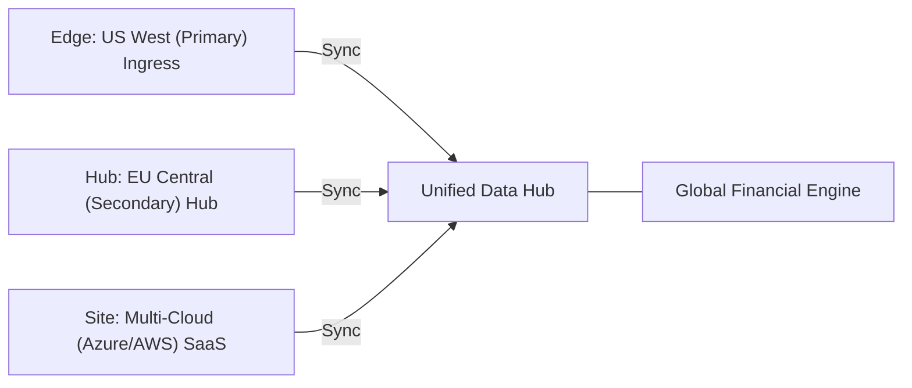

### 4. Economics Hub & High-Trust Data Plane Protection Flow
Executing complex logic for securing the bridge between finance and engineering teams, ensuring every organizational identity is verified, financial-level privacy is maintained, and every financial access is according to institutional standards.

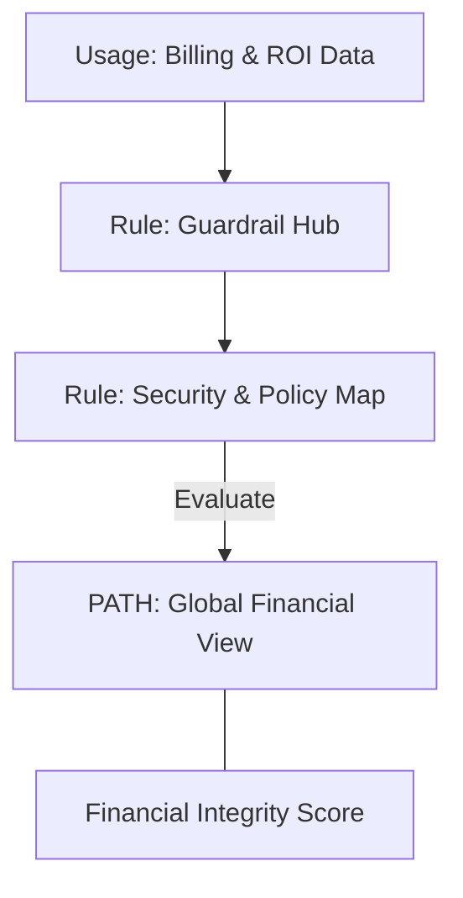

### 5. Multi-Cloud Economic Federation & Governance Flow
Automatically managing unified financial standards across global regions and diverse cloud tenants, ensuring institutional data residency and privacy boundaries by default.

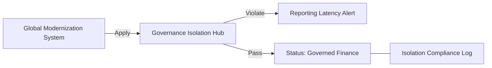

### 6. Encryption & Perimeter Protection Flow (Economics Standard)
Managing the lifecycle of a financial request, automatically enforcing institutional TLS 1.3 and resource encryption standards as required by security policy, ensuring zero-latency security confidence.

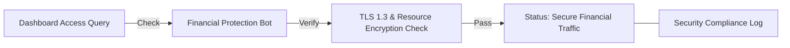

### 7. Institutional Economic Maturity Scorecard
Grading organizational performance based on key indicators: TCO Accuracy Index, ROI Realization Index, and Economic Adoption Scores.

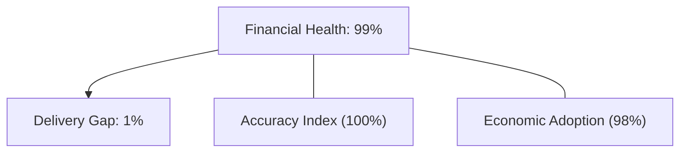

### 8. Identity & RBAC for Economic Governance
Managing fine-grained access to financial hubs, provisioning workers, and audit logs between CIOs, CFOs, and Cloud Architects.

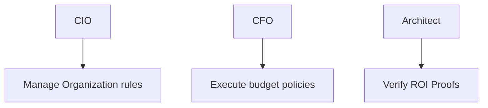

### 9. IaC Deployment: Cloud-Economics-Calculator-as-Code Framework
Using modular Terraform to deploy and manage the versioned distribution of the financial tracking hubs, modeling protection workers, and forensic metadata lakes.

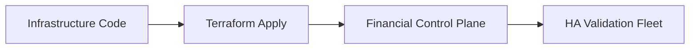

### 10. AIOps Economic Drift & Risk Validation Flow
Using advanced analytics to identify sudden surges in on-prem costs, unauthorized budget changes, suspicious configuration drifts, or unusual delivery pattern changes that could result in institutional risk or financial loss.

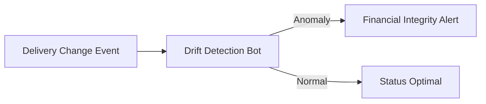

### 11. Metadata Lake for Forensic Economic Audit
Storing long-term records of every financial integration event (metadata), every model executed, and every version history for institutional record-keeping, financial auditing, and post-provisioning forensics.

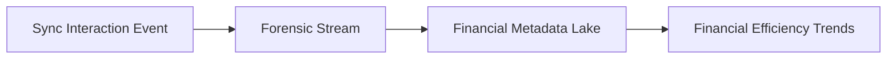

---

## 🏛️ Core Governance Pillars

1.  **Unified Foundation Coordination**: Maximizing resilience by centralizing all financial measurement through a single institutional plane.
2.  **Automated Modeling Provisioning**: Eliminating "manual calculation" scenarios through proactive orchestration and pattern verification.
3.  **Sequential ROI Intelligence**: Ensuring zero-interruption operations through dependency-aware savings-driven data engineering.
4.  **Zero-Trust Identity Protection**: Automatically enforcing identity-based access, data-at-rest encryption, and policy evaluation across all financial tiers.
5.  **Autonomous Operations Logic**: Guaranteeing reliability through automated industry-specific effectiveness monitoring runbooks.
6.  **Full Financial Auditability**: Immutable recording of every budget change and financial provision for institutional forensics.

---

## 🛠️ Technical Stack & Implementation

### Financial Engine & APIs
*   **Framework**: Python 3.11+ / FastAPI.
*   **Performance Engine**: Custom Python-based logic for multi-cloud TCO modeling and DORA-style FinOps metrics.
*   **Integrations**: Native connectors for Azure, AWS, GCP retail pricing and on-prem hardware specs.
*   **Persistence**: PostgreSQL (Financial Ledger) and Redis (Live Modeling State).
*   **Auth Orchestrator**: Federated OIDC/SAML for least-privilege financial management access.

### Governance Dashboard (UI)
*   **Framework**: React 18 / Vite.
*   **Theme**: Dark, Slate, Indigo (Modern high-fidelity productivity aesthetic).
*   **Visualization**: D3.js for delivery topologies and Recharts for ROI velocity analytics.

### Infrastructure & DevOps
*   **Runtime**: AWS EKS or Azure Kubernetes Service (AKS) for management plane.
*   **Measurement Hub**: Managed event sourcing for immutable productivity timeline reconstruction.
*   **IaC**: Modular Terraform for deploying the financial landing zone and validation fleet.

---

## 🏗️ IaC Mapping (Module Structure)

| Module | Purpose | Real Services |
| :--- | :--- | :--- |
| **`infrastructure/economics_hub`** | Central management plane | EKS, PostgreSQL, Redis |
| **`infrastructure/enforcers`** | Distributed model provisioners | Azure, AWS, GCP APIs |
| **`infrastructure/modeling_pipes`** | Data Ingestion Hubs | Webhooks, Lambda |
| **`infrastructure/auditing`** | Forensic modernization sinks | S3, Athena, Quicksight |

---

## 🚀 Deployment Guide

### Local Principal Environment
```bash
# Clone the Cloud Economics Calculator repository
git clone https://github.com/devopstrio/cloud-economics-calculator.git
cd cloud-economics-calculator

# Configure environment
cp .env.example .env

# Launch the Financial stack
make init

# Trigger a mock financial update and automated guardrail validation simulation
make simulate-calculation
```

Access the Management Portal at `http://localhost:3000`.

---

## 📜 License
Distributed under the MIT License. See `LICENSE` for more information.

---
<div align="center">
  <p>© 2026 Devopstrio. All rights reserved.</p>
</div>
